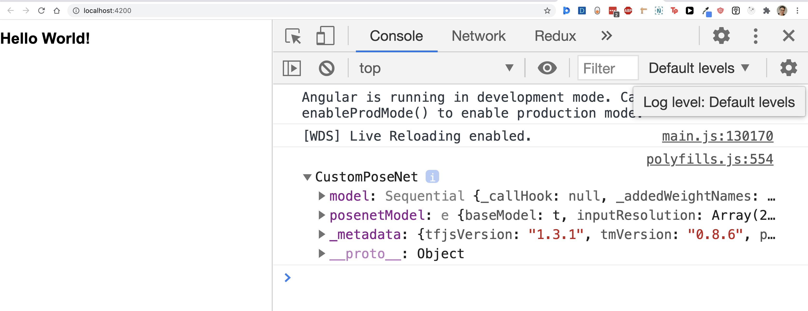
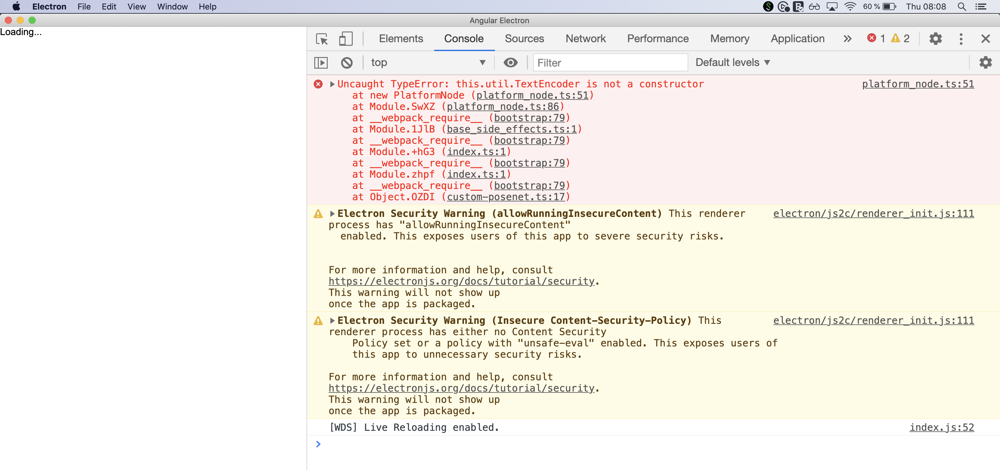

# HeadScroll

## Setup

1. Install dependencies with `yarn`
2. Start the project with `yarn start`

## Bug

`Uncaught TypeError: this.util.TextEncoder is not a constructor`

The code triggering the error is located in `app.component.ts`:

```typescript
import { Component } from "@angular/core";
import * as pose from "@teachablemachine/pose";

@Component({...})
export class AppComponent {
  readonly MODEL = "https://teachablemachine...model.json";
  readonly METADATA = "https://teachablemachine...metadata.json";

  constructor() {
    pose.load(this.MODEL, this.METADATA).then(console.log);
  }
}
```

## Browser vs Desktop

The model loads on the browser without issues. But, in desktop, it fails.

#### Browser result:


#### Electron result:



## What we have attempted so far

1. Import  `@teachablemachine/pose` as a node dependency with `require`
   1. This fail, presumably because the dependency is not meant to be consumed outside the browser
2. Install `@tensorflow/tfjs-node`
   1. Made no difference

## What we're considering

1. Not using `@teachablemachine/pose` but `@tensorflow-models/posenet` and figure a way to pass the model, metadaba, and weights.